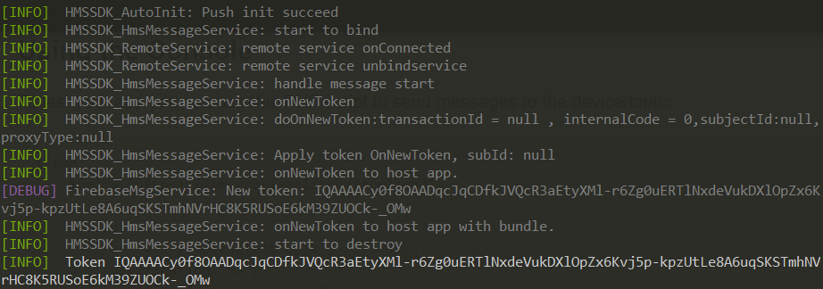
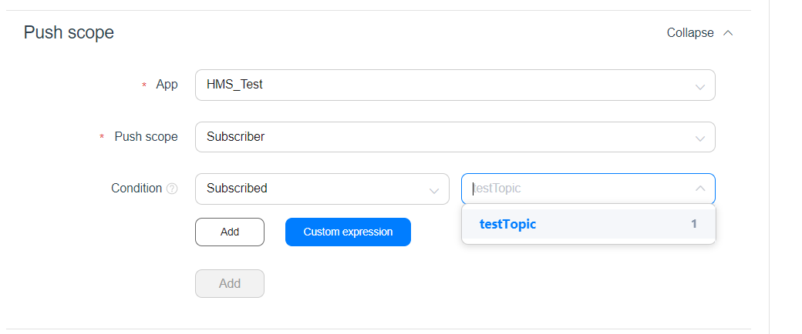
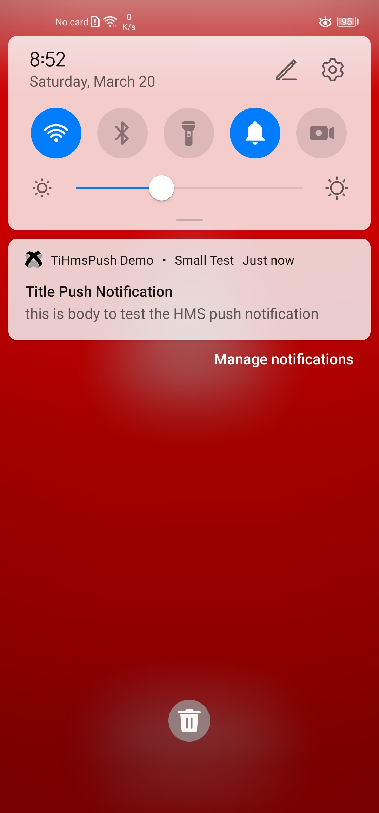

# HUAWEI Push Kit - Titanium Module

A Titanium Module to use the following [HUAWEI Push Kit](https://developer.huawei.com/consumer/en/hms/huawei-pushkit)


## Content
* [Requirements](#requirements)
* [Preparation](#preparation)
* [Notes](#notes)
* [API: Methods, Properties, Events](#api)
* [Example](#example)
* [Sending push messages](#sending-push-messages)
* [Build from source](#build)
* [Credits](#credits)

## Requirements
- [x] Make sure to add the following [HMS preparation](https://github.com/ikamaru/ti.hms.enviroment_prepration) Plugin to you project which is responsible for preparing the HMS environment in your project.

## Preparation
- [x] Download the `com.ikamaru.ti.hms.push` folder from this repo and past it inside `C:\ProgramData\Titanium\modules\android\` then add this module to your tiapp.xml as the following
```xml
<modules>
 <module version="1.0.0" platform="android">com.ikamaru.ti.hms.push</module>
</modules>
```
- [x] Before using Push Kit, enable it. For details, please refer to [Enabling Required Services](https://developer.huawei.com/consumer/en/doc/development/HMSCore-Guides-V5/android-config-agc-0000001050170137-V5#EN-US_TOPIC_0000001078601380__section9471122085218).
- [x] After enabling the Push Kit make sure to re-download the `agconnect-services.json` and add it to the root folder of your project as described in the HMS preparation [HMS preparation](https://github.com/ikamaru/ti.hms.enviroment_prepration) Plugin 

## Notes:
### Setting the Notification Icon

For a `data notification` you have to place a notification icon "ic_push_notification.png" into the following folder:
 `[application_name]/[app*]/platform/android/res/drawable/`
 or
 `[application_name]/[app*]/platform/android/res/drawable-*` (if you use custom dpi folders)

<small>**\*** = Alloy</small>

To use a custom icon for a `notification message` you need to add this attribute within the `<application/>` section of your `tiapp.xml`:

```xml
<meta-data android:name="com.huawei.messaging.default_notification_icon" android:resource="@drawable/ic_push_notification"/>
```

Otherwise the default icon will be used.

**NOTE**: 

> - The icon file stored by the app must have an extension name but the extension name must not be included in the URI. Currently, the supported file formats are .png and .jpg.
> - If both methods are used, the icon specified by the icon field will be displayed preferentially. If neither method is used, the desktop icon of your app will be used by default.
>- For details about the specifications of the customized small icon, please refer to [Notification Icon Specifications](https://developer.huawei.com/consumer/en/doc/development/HMSCore-Guides-V5/icon-spec-0000001050042013-V5).
>- If you do not set an icon, your app icon is displayed by default.
>- It is recommended that the image dimensions be 40 x 40 dp and size not exceed 512 KB.


### Data / Notification messages

There are two different messages that the phone can process: `Notification messages` and `Data messages`. A `Notification message` is processed by the system, the `Data message` is handeled inside the module. Using the `notification` block inside the POSTFIELDS will send a `Notification message`.

Supported data fields:
> * "title" => "string"
> * "message" => "string"
> * "big_text" => "string"
> * "big_text_summary" => "string"
> * "icon" => "Remote URL"
> * "image" => "Remote URL"
> * "rounded_large_icon" => "Boolean" (to display the largeIcon as a rounded image when the icon field is present)
> * "force_show_in_foreground" => "Boolean" (show notification even app is in foreground)
> * "id" => "int"
> * "color" => will tint the app name and the small icon next to it
> * "vibrate" => "boolean"
> * "sound" => "string" (e.g. "notification.mp3" will play /platform/android/res/raw/notification.mp3)
> * "badge" => "int" (if supported by the phone it will show a badge with this number)

Supported notification fields:
> * "title" => "string"
> * "body" => "string"
> * "color" => "#00ff00",
> * "tag" => "custom_notification_tag",   // push with the same tag will replace each other
> * "sound" => "string" (e.g. "notification.mp3" will play /platform/android/res/raw/notification.mp3)

## API

#### Methods

`registerForPushNotifications()`

`sendMessage(parameters)`
  - `parameters` (Object)
    - `messageID` (String)
    - `to` (String)
    - `timeToLive` (Number)
    - `data` (Object)

`subscribeToTopic(topic)`
  - `topic` (String)

`unsubscribeFromTopic(topic)`
  - `topic` (String)

`setNotificationChannel(channel)`
  - `channel` (NotificationChannel Object) Use `Ti.Android.NotificationManager.createNotificationChannel()` to create the channel and pass it to the function. See [Titanium.Android.NotificationChannel](https://docs.appcelerator.com/platform/latest/#!/api/Titanium.Android.NotificationChannel)

  _Prefered way_ to set a channel. As an alternative you can use `createNotificationChannel()`

`createNotificationChannel(parameters)`

- `parameters` (Object)
  - `sound` (String) optional, refers to a sound file (without extension) at `platform/android/res/raw`. If sound == "default" or not passed in, will use the default sound. If sound == "silent" the channel will have no sound
  - `channelId` (String) optional, defaults to "default"
  - `channelName` (String) optional, defaults to `channelId`
  - `importance` (String) optional, either "low", "high", "default". Defaults to "default", unless sound == "silent", then defaults to "low".
  - `lights` (Boolean) optional, defaults to `false`
  - `showBadge` (Boolean) optional, defaults to `false`

  Read more in the [official Android docs](https://developer.android.com/reference/android/app/NotificationChannel).

`deleteNotificationChannel(channelId)`
  - `channelId` (String) - same as the id used to create in createNotificationChannel

`setForceShowInForeground(showInForeground)`
  - `showInForeground` (Boolean) Force the notifications to be shown in foreground.

`clearLastData()`
  - Will empty the stored lastData values.

`getToken()`
  - Returns the current HMS Push Kit token.

`deleteToken()`
  - Removes the current HMS Push Kit token.


#### Properties

`shouldEstablishDirectChannel` (Number, get/set)

`token` (String, get)

`lastData` (Object)
The propery `lastData` will contain the data part when you send a notification push message (so both nodes are visible inside the push payload). Read before calling `registerForPushNotifications()`.

#### Events

`didReceiveMessage`
  - `message` (Object): The data message

`didRefreshRegistrationToken`
  - `token` (String): The HMS Push Kit Token

`subscribe`
  - `success` (Boolean): Either subscribed to the topic was done successfully or not.

`unsubscribe`
  - `success` (Boolean): Either unsubscribed from the topic was done successfully or not.

`tokenRemoved`
  - `success` (Boolean): Either the token was removed successfully or not.

## Example
```js

// Important: Include cloud messaging module after the initial configure()
var hmsPush = require('com.ikamaru.ti.hms.push');

// Called when the Firebase token is ready
hmsPush.addEventListener('didRefreshRegistrationToken', onToken);

// Called when direct messages arrive. Note that these are different from push notifications
hmsPush.addEventListener('didReceiveMessage', onMessage);

function onToken(e) {
    Ti.API.info('Token', e.token);
}

function onMessage(e) {
    Ti.API.info('Message', e.message);
}

// Android: For configuring custom sounds and importance for the generated system
// notifications when app is in the background
hmsPush.createNotificationChannel({
    sound: 'warn_sound',
    channelId: 'general',
    channelName: 'General Notifications',
    importance: 'high', //will pop in from the top and make a sound
    showBadge: true
});
hmsPush.registerForPushNotifications();
Ti.API.info("Last data: " + hmsPush.lastData);


// check if token is already available
if (hmsPush.token !== null) {
    Ti.API.info('hmsPush-Token', hmsPush.token);
} else {
    Ti.API.info('Token is empty. Waiting for the token callback ...');
}


// subscribe to topic
hmsPush.subscribeToTopic('testTopic');
```

## Sending push messages
### Using HTTPS requests 
Push Kit supports HTTPS for sending both uplink and downlink messages, for more detail please refer to the following [documentation](https://developer.huawei.com/consumer/en/doc/development/HMSCore-Guides-V5/android-server-dev-0000001050040110-V5).

###  Using the Console
To test your app you can send messages on the Push Kit console in AppGallery Connect as described below:
- Sign in to [AppGallery Connect](https://developer.huawei.com/consumer/en/service/josp/agc/index.html), select My projects, and find your project in the project list. Go to Project settings > Grow > Push Kit > Notifications. Click Add notification to create a task.
- For more detail refer to the following [guide](https://developer.huawei.com/consumer/en/doc/development/HMSCore-Guides-V5/msg-sending-0000001050042119-V5).

In the previous example we did print the token in log, copy that token:


Fill the Notification information:


You can send Push notification or data message:

- To specified device using the token we copied:


- To subscribers:


Result:



## Build
```bash
titanium build --platform android --keystore "PATH_TO_KEY_STORE.jks" --key-password "KEY_PWS" --alias "ALIAS" --store-password "STORE_PWD" 
```
> **Note**: 
> - When building for Android, make sure you have sign the app using the keystore that you used to configure your SHA256 fingerprint of your project in AppGallery Connect 
> - you can add `-T device -C all` to the above command to run on the device directly. 

## Credits
Special thanks to *Hans Knöchel* & *Michael Gangolf*, This module is based on their [firebase.cloudmessaging](https://github.com/hansemannn/titanium-firebase-cloud-messaging) module.

## Legal

(c) 2021 by *Ikamaru*
